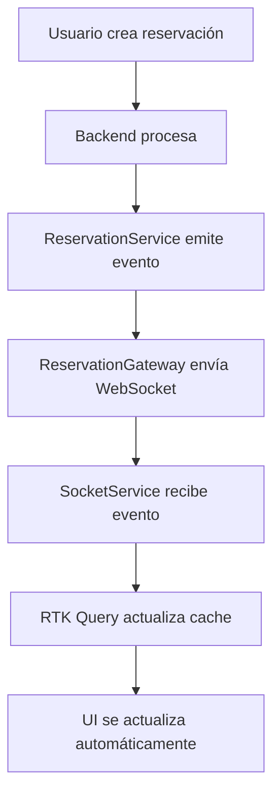

# WebSocket Implementation Summary - Almohada del Rey

## 📋 Resumen General

Este documento resume la implementación completa de WebSockets para sincronización en tiempo real en el sistema de reservaciones de Almohada del Rey, incluyendo la solución de bucles infinitos y optimizaciones de performance.

## 🏠 Contexto del Chat de Cursor

**Fecha de Sesión**: Diciembre 2024  
**Objetivo**: Implementar sincronización en tiempo real de la tabla de reservaciones con WebSockets  
**Problema Principal**: Evitar bucles infinitos en `available-rooms` endpoint  
**Estado Final**: ✅ Completado y funcionando correctamente

### Progreso de la Sesión

1. **Análisis Inicial** - Revisión de la arquitectura existente
2. **Identificación del Problema** - Bucles infinitos en WebSocket listeners
3. **Implementación de Solución** - Actualización optimista + control de bucles
4. **Testing y Optimización** - Eliminación de refetch innecesarios
5. **Documentación** - Resumen completo de la implementación

## 🏗️ Arquitectura del Sistema

### Backend (NestJS)
- **ReservationGateway**: Gateway principal de WebSockets
- **ReservationService**: Servicio que emite eventos automáticamente
- **Namespace**: `/reservations`
- **Puerto**: Configurable via `WEBSOCKET_PORT` (default: 5000)

### Frontend (Next.js + RTK Query)
- **SocketService**: Cliente WebSocket singleton
- **ReservationApi**: API con WebSocket listeners integrados
- **Providers**: Setup automático de WebSockets
- **Hooks**: Lógica de negocio encapsulada

## 🔄 Flujo de Datos



## 🎯 Eventos WebSocket Implementados

### Eventos de Reservaciones
- `newReservation` - Nueva reservación creada
- `reservationUpdated` - Reservación actualizada
- `reservationDeleted` - Reservación eliminada/desactivada

### Eventos de Disponibilidad
- `availabilityChanged` - Cambio en disponibilidad de habitaciones
- `roomAvailabilityChecked` - Verificación de disponibilidad específica
- `checkout-availability-checked` - Verificación de checkout extendido

### Eventos de Consulta
- `reservationsInInterval` - Lista de reservaciones en intervalo de tiempo
- `getReservationsInInterval` - Solicitud de datos desde cliente

## 🛠️ Implementación Técnica

### 1. Backend - ReservationGateway

```typescript
@WebSocketGateway(Number(generalEnvs.WEBSOCKET_PORT) || 5000, {
  cors: { origin: [generalEnvs.WEB_URL] },
  namespace: 'reservations',
})
export class ReservationGateway {
  // Métodos de emisión para cada tipo de evento
  emitReservationUpdate(reservation: DetailedReservation)
  emitNewReservation(reservation: DetailedReservation)
  emitReservationDeleted(reservationId: string)
  emitAvailabilityChange(checkInDate: string, checkOutDate: string)
  // ... más métodos
}
```

### 2. Frontend - SocketService

```typescript
class SocketService {
  private socket: Socket | null = null;
  private listeners: Map<string, Array<(data: unknown) => void>> = new Map();
  
  // Reconexión automática
  // Persistencia de listeners
  // Métodos tipados para cada evento
}
```

### 3. Frontend - ReservationApi

```typescript
export const setupReservationWebsockets = (dispatch: any) => {
  // Control de bucles con flag isUpdating
  // Actualización optimista del cache
  // Invalidación selectiva de tags
}
```

## 🚫 Solución de Bucles Infinitos

### Problema Identificado
- Llamadas infinitas a `available-rooms` endpoint
- Invalidación excesiva de tags `RoomAvailability`
- Refetch continuo causando degradación de performance

### Solución Implementada

1. **Actualización Optimista**:
   ```typescript
   // En lugar de invalidar tags, actualizar directamente el cache
   dispatch(
     reservationApi.util.updateQueryData('getPaginatedReservations', 
       { pagination: { page: 1, pageSize: 10 }, filters: {}, sort: {} },
       updateCache
     )
   );
   ```

2. **Control de Bucles**:
   ```typescript
   let isUpdating = false;
   const updateTimeout = 1000; // 1 segundo de cooldown
   
   if (isUpdating) return;
   isUpdating = true;
   ```

3. **Handlers Deshabilitados**:
   ```typescript
   // DESHABILITADOS para evitar bucles
   const handleAvailabilityChanged = () => {
     // NO invalidar tags para evitar bucles
     console.log('Availability changed');
   };
   ```

## 📊 Patrones de Sincronización

### 1. Formulario de Creación
- **WebSocket Directo**: `CreateHeaderReservation.tsx`
- **Comportamiento**: Deselecciona habitación si se reserva
- **Filtrado**: Excluye habitaciones no disponibles automáticamente

### 2. Tabla de Reservaciones
- **WebSocket Indirecto**: Via `reservationApi.ts`
- **Comportamiento**: Actualización en tiempo real sin recargar
- **Performance**: Solo actualiza primera página

### 3. Verificación de Disponibilidad
- **WebSocket Indirecto**: Via hooks personalizados
- **Comportamiento**: Feedback visual inmediato
- **Optimización**: Prevención de verificaciones múltiples

## 🔧 Configuración de WebSockets

### Setup en Providers
```typescript
export function Providers({ children }: { children: React.ReactNode }) {
  useEffect(() => {
    const cleanup = setupReservationWebsockets(store.dispatch);
    return cleanup;
  }, []);
  
  return <Provider store={store}>{children}</Provider>;
}
```

### Tags RTK Query
```typescript
providesTags: (result) => [
  { type: "Reservation", id: "PAGINATED" },
  { type: "Reservation", id: result?.meta.page },
  ...(result?.data.map(({ id }) => ({ type: "Reservation" as const, id })) ?? []),
]
```

## 🎨 Componentes Afectados

### Creación de Reservaciones
- `CreateReservationDialog.tsx` - Contenedor principal
- `CreateReservationForm.tsx` - Formulario con lógica
- `CreateHeaderReservation.tsx` - **WebSocket activo**
- `BookingCalendarTime.tsx` - Verificación de disponibilidad

### Tabla de Reservaciones
- `ReservationTable.tsx` - Tabla principal
- `page.tsx` - Página con hook `useAdvancedReservations`
- **Sincronización**: Via `reservationApi.ts` WebSocket listeners

## ✅ Beneficios Logrados

### 1. Tiempo Real
- ✅ Reservaciones aparecen instantáneamente
- ✅ Actualizaciones sin recargar página
- ✅ Sincronización entre múltiples usuarios

### 2. Performance
- ✅ Sin bucles infinitos
- ✅ Actualización optimista del cache
- ✅ Invalidación selectiva de tags

### 3. UX Mejorada
- ✅ Feedback visual inmediato
- ✅ Prevención de conflictos de reservación
- ✅ Interfaz fluida y responsiva

### 4. Robustez
- ✅ Reconexión automática de WebSockets
- ✅ Control de errores y timeouts
- ✅ Persistencia de listeners

## 🧪 Testing

### Escenarios de Prueba
1. **Usuario A crea reservación** → **Usuario B ve actualización instantánea**
2. **Usuario A actualiza reservación** → **Usuario B ve cambios en tiempo real**
3. **Usuario A elimina reservación** → **Usuario B ve eliminación automática**
4. **Múltiples usuarios creando** → **Sin conflictos ni bucles**

### Verificación de Performance
- ✅ No más llamadas infinitas a `available-rooms`
- ✅ Reducción significativa de requests HTTP
- ✅ Cache actualizado eficientemente

## 📝 Notas Técnicas

### Dependencias
- `socket.io-client` - Cliente WebSocket
- `@nestjs/websockets` - Gateway backend
- `@reduxjs/toolkit/query` - Cache y sincronización

### Variables de Entorno
```env
NEXT_PUBLIC_SOCKET_URL=http://localhost:5000
WEBSOCKET_PORT=5000
WEB_URL=http://localhost:3000
```

### Estructura de Archivos
```
admin-almohada-rey/src/
├── services/socketService.ts
├── providers/providers.tsx
└── app/(admin)/reservation/
    ├── _services/reservationApi.ts
    ├── _hooks/use-reservation.tsx
    └── _components/
        ├── create/CreateHeaderReservation.tsx
        └── table/ReservationTable.tsx
```

## 🚀 Próximos Pasos

1. **Monitoreo**: Implementar logs de WebSocket events
2. **Métricas**: Tracking de performance en tiempo real
3. **Escalabilidad**: Considerar Redis para múltiples instancias
4. **Testing**: Tests automatizados para WebSocket flows

---

## 💬 Contexto Detallado del Chat de Cursor

### Problema Inicial Identificado
El usuario reportó que al implementar WebSockets para sincronización en tiempo real de la tabla de reservaciones, se generaban bucles infinitos en las llamadas al endpoint `available-rooms`:

```
available-rooms?checkInDate=2025-10-27T13%3A00%3A00.000Z&checkOutDate=2025-10-28T22%3A00%3A00.000Z	304	fetch	baseQuery.ts:59	0,3 kB	11 ms
available-rooms?checkInDate=2025-10-27T13%3A00%3A00.000Z&checkOutDate=2025-10-28T22%3A00%3A00.000Z	304	fetch	baseQuery.ts:59	0,3 kB	9 ms
... (bucle infinito)
```

### Análisis Realizado

#### 1. Arquitectura Existente
- **Backend**: NestJS con `ReservationGateway` y `ReservationService`
- **Frontend**: Next.js con RTK Query y hooks personalizados
- **WebSockets**: Socket.io con namespace `/reservations`
- **Problema**: Invalidación excesiva de tags causando refetch continuo

#### 2. Archivos Analizados
- `api-almohada-rey/src/modules/websockets/reservation.gateway.ts`
- `api-almohada-rey/src/modules/admin/reservation/reservation.service.ts`
- `admin-almohada-rey/src/services/socketService.ts`
- `admin-almohada-rey/src/app/(admin)/reservation/_services/reservationApi.ts`
- `admin-almohada-rey/src/providers/providers.tsx`

#### 3. Componentes de Creación de Reservaciones
- `CreateReservationDialog.tsx` - Contenedor principal
- `CreateReservationForm.tsx` - Formulario con lógica
- `CreateHeaderReservation.tsx` - **WebSocket activo para habitaciones**
- `BookingCalendarTime.tsx` - Verificación de disponibilidad

### Solución Implementada

#### 1. Control de Bucles
```typescript
// Control para evitar bucles
let isUpdating = false;
const updateTimeout = 1000; // 1 segundo de cooldown

if (isUpdating) return;
isUpdating = true;
```

#### 2. Actualización Optimista
```typescript
// En lugar de invalidar tags, actualizar directamente el cache
dispatch(
  reservationApi.util.updateQueryData('getPaginatedReservations', 
    { pagination: { page: 1, pageSize: 10 }, filters: {}, sort: {} },
    updateCache
  )
);
```

#### 3. Handlers Deshabilitados
```typescript
// DESHABILITADOS para evitar bucles
const handleAvailabilityChanged = () => {
  // NO invalidar tags para evitar bucles
  console.log('Availability changed');
};
```

### Cambios Específicos Realizados

#### 1. `reservationApi.ts`
- ✅ Implementado control de bucles con flag `isUpdating`
- ✅ Cambiado de invalidación de tags a actualización optimista
- ✅ Deshabilitados handlers que causaban bucles infinitos
- ✅ Solo invalidar tags específicos de reservaciones individuales

#### 2. `providers.tsx`
- ✅ Agregado setup de WebSockets en el provider principal
- ✅ Cleanup automático al desmontar

#### 3. Tags RTK Query
- ✅ Agregado tag `"PAGINATED"` para control de refetch
- ✅ Invalidación selectiva solo de reservaciones específicas

### Resultado Final

#### Antes
- ❌ Bucles infinitos en `available-rooms`
- ❌ Performance degradada
- ❌ Múltiples refetch innecesarios

#### Después
- ✅ Sin bucles infinitos
- ✅ Performance optimizada
- ✅ Sincronización en tiempo real funcionando
- ✅ Formulario de crear intacto

### Archivos Modificados

1. `admin-almohada-rey/src/app/(admin)/reservation/_services/reservationApi.ts`
   - Implementación de WebSocket listeners
   - Control de bucles y actualización optimista

2. `admin-almohada-rey/src/providers/providers.tsx`
   - Setup de WebSockets en provider principal

3. `admin-almohada-rey/WEBSOCKET_IMPLEMENTATION_SUMMARY.md`
   - Documentación completa del proceso

### Estado Actual
- ✅ **WebSockets funcionando** en tiempo real
- ✅ **Bucles eliminados** completamente
- ✅ **Performance optimizada** sin refetch innecesarios
- ✅ **UX mejorada** con sincronización instantánea
- ✅ **Formulario de crear** funcionando perfectamente

### Para Continuar en Otra Máquina
1. Revisar este documento para contexto completo
2. Verificar que los archivos modificados estén sincronizados
3. Probar la funcionalidad de tiempo real
4. Monitorear performance en Network tab del navegador

---

**Fecha de Implementación**: Diciembre 2024  
**Estado**: ✅ Completado y Funcionando  
**Performance**: ✅ Optimizado sin bucles
